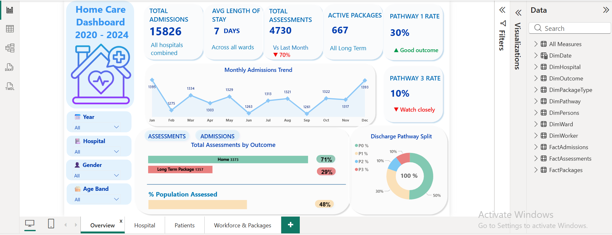
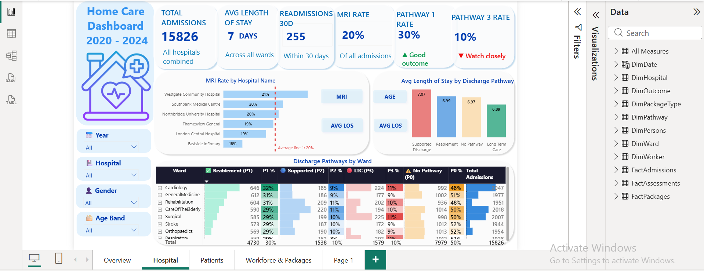

#  PowerBI Insights: Hospital Discharge and Social Care Performance Analytics 2000 - 2024

## Introduction

This project analyses social care and hospital activity data for **8,000 service users** between **2020 and 2024**, combining information from hospital admissions, social care assessments, care packages, and demographics.

Using a **Power BI Star Schema** model with multiple fact and dimension tables, the dashboard was designed to provide insights into:

- Hospital discharge performance
- Workforce effectiveness
- Equity of outcomes
- Care package management

The analysis aims to identify trends and opportunities to improve service delivery, reduce long-term care demand, and support more effective resource planning.

---

## Project Questions

- How many people receive a social care assessment, and what is the assessment gap?
- Which hospitals and wards have the highest long-term care and no-pathway rates?
- How does length of stay vary across discharge pathways?
- Are MRI scans distributed equitably across patient groups and pathways?
- Do assessment outcomes vary by ethnicity?
- How consistent is performance across social care workers?
- What admission trends and seasonal patterns affect service demand?
- Which wards should be prioritised for additional social care support?
- Is the 30-day readmission rate within expected benchmarks, and does it vary by pathway?

## Hospital Intelligence

Westgate Community Hospital records the highest MRI rate at 21% while Eastside Infirmary sits lowest at 18%, pointing to real differences in clinical complexity between hospitals that admission numbers alone would not reveal. The average length of stay is almost identical across all hospitals at around 7 days, which means bed occupancy pressure is evenly shared — but Pathway 3 rates still differ, confirming that discharge planning quality varies independently of how long patients stay.

---
## Key Findings

- The dashboard recorded **15,826 admissions** across 6 hospitals with an average length of stay of **7 days**, while only **4,730 social care assessments** were completed, covering **48% of the known population**.
- Total assessments fell by **70% month-on-month**, and all **667 active care packages** were classified as **Long Term Care**, with no active Reablement packages.
- **71%** of assessed patients returned home successfully, while **29%** required Long Term Care. The **Pathway 1 rate** was **30%** and the **Pathway 3 rate** was **10%**.
- Monthly admissions peaked at **1,395 in January** and reached a low of **1,261 in September**, indicating a clear seasonal trend.
- **50% of all discharges** had no pathway assigned, with rates ranging from **48% to 52%** across all wards.
- The **Surgical ward** recorded the highest Long-Term Care rate (**11%**), while **Stroke** and **Orthopaedics** recorded the lowest (**9%**). **Cardiology** achieved the highest Reablement rate (**32%**).
- **Supported Discharge** patients had the longest average stay (**7.07 days**), while **Long-Term Care** patients had the shortest (**6.89 days**), compared with an overall average of **6.98 days**.
- **Westgate Community Hospital** recorded the highest MRI utilisation (**21%**) and **Eastside Infirmary** the lowest (**18%**), against an overall average of **20%**.
- MRI usage remained consistent across discharge pathways, ranging from **19.3% to 20.1%**, suggesting allocation based on clinical need.
- LTP rates varied only slightly across ethnic groups, from **27.9% (Asian)** to **29.8% (Black)**, indicating broadly equitable outcomes.
- Worker performance was highly consistent, with LTP rates ranging from **27.9%** to **29.2%**. **Jordan Smith** managed the highest caseload with **994 assessments**.

- ## Author:
Linkedin: [Nasrine Gouader](https://www.linkedin.com/in/nasrine-gouader)
